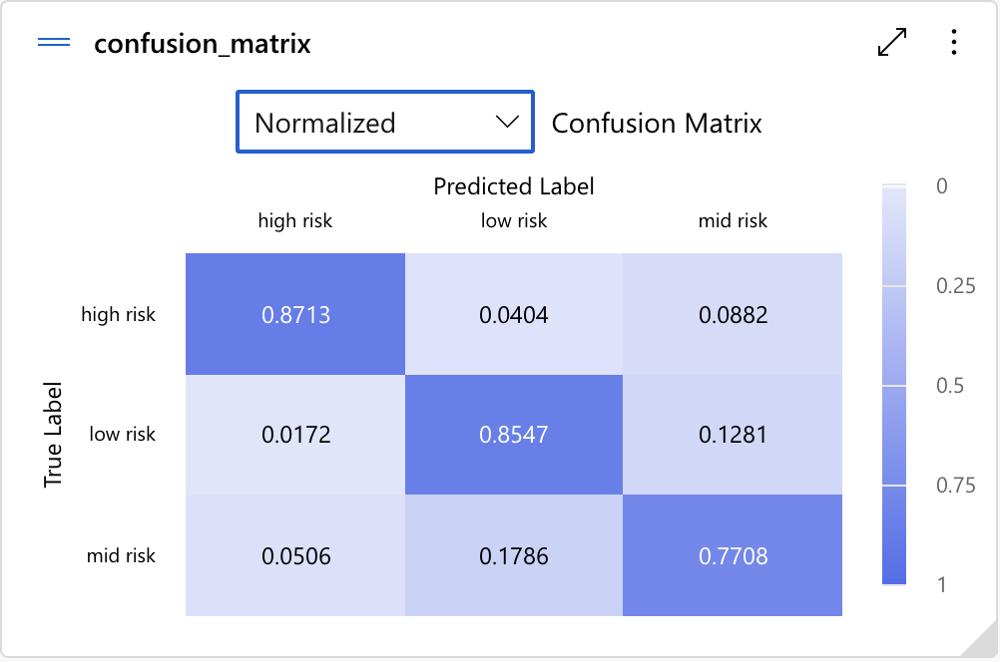
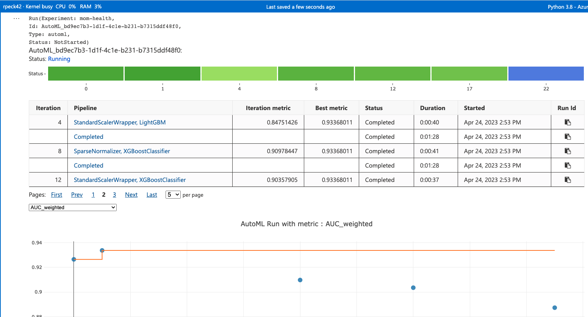
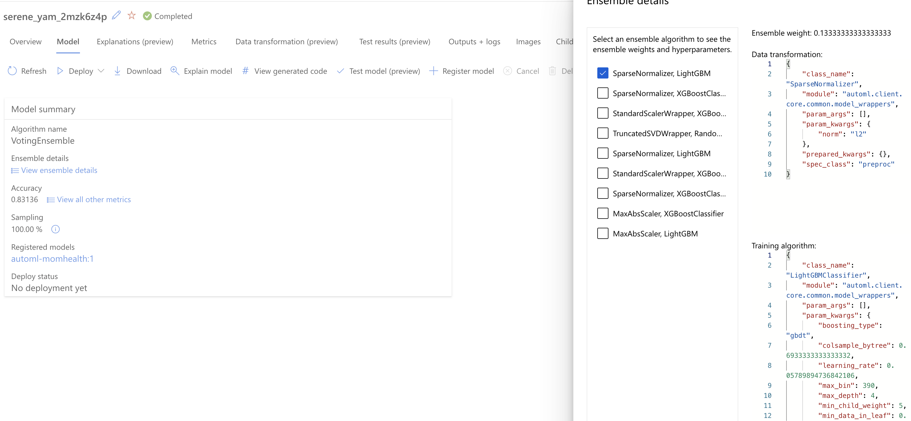
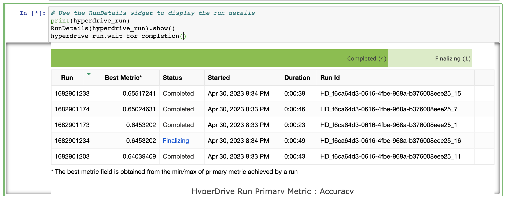
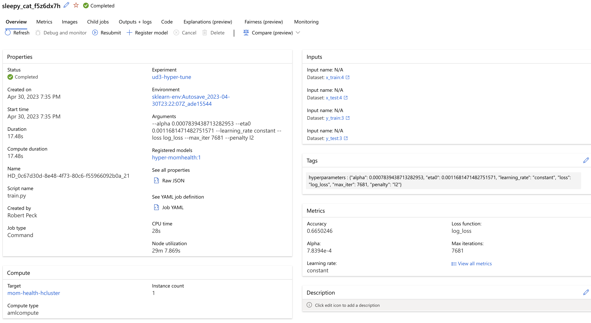

# Maternal Health Predictions

Maternal health risks are critical to understand during pregnancy and child birth. The earlier risks can be identified the sooner health condition monitoring and management can be practiced to maintain as healthy a mom as possible.

In this project, I'll be using the Maternal Health Risk data set from the [UCI Machine Learning repository](https://archive.ics.uci.edu/ml/datasets/Maternal+Health+Risk+Data+Set) to predict the *RiskLevel* based on the other parameters.

## Project Set Up and Installation

This project has several important files:

* automl.ipynb - Jupyter notebook for the Azure AutoML setup, training, model regiseration, and model deployment
* hyperparameter_tuning.ipynb - Jupyter notebook for the hyperparameter tuning setup, training, and model registeration
* train.py - training script for hyperparameter tuning utilizing SGDClassifier algorithm
* train_lr.py - training script for hyperparameter tuning utilizing LogisticRegression algorithm
* env.yaml - environment configuration file for the hyperparameter tuning experiments.
* data/Maternal Health Risk Data Set.csv - training and test data for the experiments

To recreate this project, you'll need an Azure account with access to Azure ML Studio.

1. Provision an Azure ML Studio environment
2. Provision a compute instance for executing your Jupyter notebooks - a small instance such as Standard_DS11_v2 is sufficient for executing the notebooks.
3. To execute the AutoML experiments, open the automl.ipynb notebook and begin execution of the notebook.  The code in the notebook will handle creating any of the compute cluster environments, setting up the experiment, testing the deployed model as a web service and deprovision compute cluster and web service resources.
4. To execute the hyperparameter experiments, open the hyperparameter_tuning.ipynb notebook and begin execution of the notebook.  The code in the notebook will handle creating any of the compute cluster environments, setting up the experiment, registering the model and deprovision compute cluster and web service resources.

## Dataset

### Overview

Data has been collected from different hospitals, community clinics, maternal health cares from the rural areas of Bangladesh through the IoT based risk monitoring system.

This data set contains 1,014 records with 7 attributes including:

* Age: Any ages in years when a women during pregnant.
* SystolicBP: Upper value of Blood Pressure in mmHg, another significant attribute during pregnancy.
* DiastolicBP: Lower value of Blood Pressure in mmHg, another significant attribute during pregnancy.
* BS: Blood glucose levels is in terms of a molar concentration, mmol/L.
* HeartRate: A normal resting heart rate in beats per minute.
* Risk Level: Predicted Risk Intensity Level during pregnancy considering the previous attribute.

RiskLevel is one of

* "low risk"
* "mid risk"
* "high risk"

Dataset source: [UCI Machine Learning Repository](https://archive.ics.uci.edu/ml/datasets/Maternal+Health+Risk+Data+Set#)

### Task

The objective of training this model is to predict the *RiskLevel* parameter of the data. Being able to predict this in a real healthcare setting would enable earlier management of underlying causes and potentially lead to better health outcomes for mom and baby.

### Access

Data is accessed in two ways for these experiments.

For the AutoML experiment, the data is accessed directly from the [UCI Machine Learning repository](https://archive.ics.uci.edu/ml/datasets/Maternal+Health+Risk+Data+Set). This dataset is then stored in a tabular dataset for use by the AutoML engine.

For the hyperparameter tuning experiment, the data is also accessed directly from the the [UCI Machine Learning repository](https://archive.ics.uci.edu/ml/datasets/Maternal+Health+Risk+Data+Set). However, the difference is that this dataset is the processed (feature engineering) and stored as four separate datasets (x_train, y_train, x_test, y_test) in the datastore. The training script accesses the data via the datastores for model training and evaluation.

## Automated ML

The `automl` settings and configuration used for this experiment were

```
automl_settings = {
    "experiment_timeout_minutes": 20,
    "max_concurrent_iterations": 5,
    "primary_metric" : 'accuracy'
}

automl_config = AutoMLConfig(compute_target=my_compute_target,
                             task = "classification",
                             training_data=dataset,
                             label_column_name="RiskLevel",
                             path = project_folder,
                             enable_early_stopping= True,
                             featurization= 'auto',
                             debug_log = "automl_errors.log",
                             **automl_settings
                            )
```

* timeout setting of 20 minutes so that the experiment does not continue excessively
* concurrent iterations of 5 so that the nodes are efficiently used
* primary metric to optimize is accuracy as a measure of model performance

### Results

AutoML produced the best performing model utilizing a VotingEnsemble algorithm composed of nine different voters. Each of these had a different weight ranging from 0.13333 to 0.26666.

The VotingEnsemble produced an accuracy of 83.13% which was almost 2% more than the next best algorithm scoring 81.66% accuracy.

To further improve results, I'd evaluate the confusion matrix (see below) to see what more could be done to eliminate the False Negatives as improperly missing a high risk patient would have more detrimental impact to the individual's health than monitoring a False Positive patient who is otherwise healthy.



**RunDetails Screenshot**


**Best Model from AutoML**


## Hyperparameter Tuning

For this project, I selected two different classification algorithms - SGDClassifier and LogisticRegression. I selected these for their ability to preform relatively well on general classification problems.

Furthermore, I experimented with different paramater sampling models, trying both Random and Grid sampling. Overall, sampling models did not significantly impact the algorithm performance, so I standardized on the Random sampling.

For the SGDClassifier model I varied the following hyperparameters:

* alpha
* max_iter
* learning_rate
* eta0

For the LogisticRegression model I varied the following hyperparameters:

* solver
* penalty
* multi_class
* max_iter
* C

### Results

Neither SGDClassifier nor LogisticRegression showed significant performance differences over the other. Both produced results around 66% accuracy with all the same feature engineering done on the data.

Overall though, the results achived in the hyperparameter tuning were comprable to the AutoML models that used LogisticRegression.  This gives me confidence that the best possible performance was achieved with the modle and feature engineering selected.

**Run Details**


**Best Model**


## Model Deployment

I selected to use the model generated by the AutoML experiment to deploy as the endpoint. To do this, I registered the model and downloaded the scoring file created by AutoML.

```
best_model = best_run.register_model(model_name='automl-momhealth', model_path='outputs/model.pkl')
print(best_model.name, best_model.description, best_model.version)

best_run.download_file("outputs/scoring_file_v_1_0_0.py", "score.py")
```

With these artifacts saved, then it is simply a matter of creating the `InterfaceConfig`, `demployment_configuration` and then deploying the model using `Model.deploy`

Once deployed, we're able to test the web service endpoing using the following code:

```
# Define the input data as a JSON object
data =  {
  "data": [
    {
      "Age": 25,
      "SystolicBP": 130,
      "DiastolicBP": 80,
      "BS": 15,
      "BodyTemp": 98.0,
      "HeartRate": 86
    }
  ],
  "method": "predict"
}

body = str.encode(json.dumps(data))

headers = {'Content-Type':'application/json', 'Authorization':('Bearer '+ service.get_keys()[0])}

req = urllib.request.Request(service.scoring_uri, body, headers)

try:
    response = urllib.request.urlopen(req)

    result = response.read()
    print(result)
except urllib.error.HTTPError as error:
    print("The request failed with status code: " + str(error.code))

    # Print the headers - they include the requert ID and the timestamp, which are useful for debugging the failure
    print(error.info())
    print(error.read().decode("utf8", 'ignore'))
```

## Screen Recording

[Link to published video for Capstone Project](https://youtu.be/dw9YapX8SC8)

## Standout Suggestions

I selected the hyperparameter evaluation of different ML models as the extra work completed during this project.  Those results were discussed above.


[def]: https://youtu.be/dw9YapX8SC8